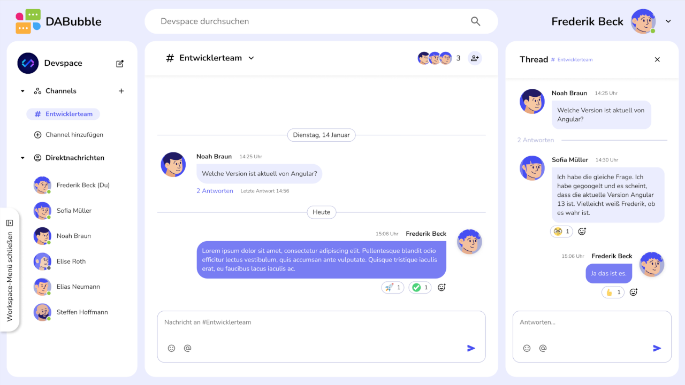
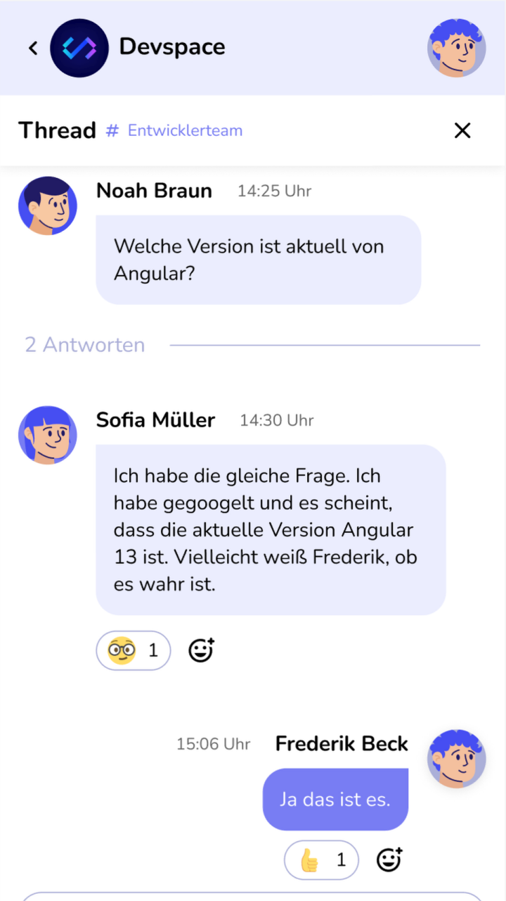

# 💬 DABubble – Discord Clone Chat App

[](https://angular.io/)
[](https://www.typescriptlang.org/)
[](https://firebase.google.com/)
[](https://sass-lang.com/)
[](LICENSE)

A modern, real-time chat application inspired by Discord, built with Angular 21, Firebase, and TypeScript. Features channels, direct messages, threads, reactions, and user management.

---

## 🚀 Live Demo

🔗 **[dabubble.dev2k.org](https://dabubble.dev2k.org)**

---

## 📸 Preview

### Desktop View



### Mobile View



---

## ✨ Features

### 👤 User Account & Administration

- 🔐 **User Registration** – Email/password with avatar selection
- 🔑 **User Login** – Secure authentication with Firebase
- 🔄 **Password Recovery** – Reset password via email
- ✏️ **Profile Editing** – Update name and avatar
- 📱 **Responsive Menu** – Minimizable channels/DM sidebar
- 🟢 **Online Status** _(Optional)_ – Real-time user presence

### 💬 Channels & Direct Messages

- 💌 **Direct Messages** – Private 1:1 conversations
- 😄 **Emoticon Reactions** – React to messages with emojis
- 🎨 **Emoticons in Messages** – Rich emoji support
- @ **Mention Users** – Tag members with `@username`
- \# **Mention Channels** – Reference channels with `#channel`
- 🧵 **Threads** – Reply to specific messages in threads
- 🔍 **Search Messages** – Find messages across channels and DMs

### 🔧 Channel Management

- ➕ **Create Channels** – Set name, description, and members
- 👥 **Add Members** – Invite users to existing channels
- 🚪 **Leave Channels** – Exit channels you don't need
- ✏️ **Edit Channels** – Modify name and description
- 🔒 **Duplicate Prevention** – No duplicate channel names

---

## 🛠️ Tech Stack

**Frontend**

- Angular 21 (Standalone Components, Signals, Zoneless)
- TypeScript 5.9 (Strict mode, isolatedModules)
- SCSS (BEM Methodology)
- RxJS 7.8
- NgRx SignalStore (State Management)

**Backend & Database**

- Firebase Authentication (Email/Password, Google OAuth Popup)
- Cloud Firestore (NoSQL Database)
- Firebase Storage (File uploads)
- Real-time listeners

**Code Quality**

- TypeScript Strict Mode
- ESLint & Prettier
- JSDoc Documentation
- Max 14 lines per function
- Max 100 LOC per modular file (stores)
- Max 400 LOC per file (general)

**DevOps & Hosting**

- GitHub (Version Control)
- Firebase Hosting (Reference)
- IONOS Apache Hosting (Production: dabubble.dev2k.org)
- .htaccess SPA routing configuration

---

## 📁 Project Structure

```
dabubble/
├── .github/
│   ├── prompts/
│   │   ├── copilot-angular.prompt.md      # Angular dev standards
│   │   └── copilot-project.prompt.md      # Project requirements
│   └── workflows/
│       └── deploy.yml                     # CI/CD Pipeline (future)
├── public/
│   ├── favicon.ico
│   ├── manifest-dark.webmanifest          # PWA manifest (dark)
│   ├── manifest-light.webmanifest         # PWA manifest (light)
│   └── img/                               # Public images & icons
├── src/
│   ├── app/
│   │   ├── core/                          # Singleton Services, Guards, Models
│   │   │   ├── components/                # Core Layout Components
│   │   │   │   ├── auth-layout/           # Auth Pages Layout Wrapper
│   │   │   │   ├── header/                # Auth Header Component
│   │   │   │   └── footer/                # Auth Footer Component
│   │   │   ├── guards/                    # Route Guards
│   │   │   │   ├── auth.guard.ts          # Protect authenticated routes
│   │   │   │   └── no-auth.guard.ts       # Redirect if authenticated
│   │   │   ├── interceptors/              # HTTP interceptors
│   │   │   ├── models/                    # Domain Models (User, Channel, Message)
│   │   │   └── services/                  # Core Services
│   │   │       └── i18n/                  # Internationalization
│   │   ├── features/                      # Feature Modules (Business Logic)
│   │   │   ├── auth/                      # Authentication Feature
│   │   │   │   ├── pages/
│   │   │   │   │   ├── signin/            # SignIn Page (Email + Google OAuth Popup)
│   │   │   │   │   ├── signup/            # SignUp Page
│   │   │   │   │   ├── password-reset/    # Password Reset Page
│   │   │   │   │   ├── imprint/           # Legal: Imprint
│   │   │   │   │   └── privacy-police/    # Legal: Privacy Policy
│   │   │   │   └── components/
│   │   │   │       └── popup-signup/      # Signup Popup (from Header)
│   │   │   ├── channels/                  # Channel Management
│   │   │   │   ├── components/
│   │   │   │   │   ├── channel-list/
│   │   │   │   │   └── channel-create/
│   │   │   │   └── services/
│   │   │   │       └── channel.service.ts
│   │   │   ├── messages/                  # Messages & Threads
│   │   │   │   ├── components/
│   │   │   │   │   ├── message-list/
│   │   │   │   │   ├── message-input/
│   │   │   │   │   └── thread-view/
│   │   │   │   └── services/
│   │   │   │       └── message.service.ts
│   │   │   └── users/                     # User Management
│   │   │       ├── components/
│   │   │       │   └── user-profile/
│   │   │       └── services/
│   │   │           └── user.service.ts
│   │   ├── layout/                        # Main App Layout (post-auth)
│   │   │   ├── main-layout/               # Main Layout with Sidebar
│   │   │   ├── sidebar/                   # Navigation Sidebar
│   │   │   └── header/                    # Top Header Bar
│   │   ├── shared/                        # Shared/Reusable Components
│   │   │   ├── components/
│   │   │   │   ├── input-field/           # Form Input Component
│   │   │   │   ├── primary-button/        # Primary Button Component
│   │   │   │   ├── dabubble-logo/         # App Logo Component
│   │   │   │   └── legal-information/     # Footer Legal Links
│   │   │   ├── directives/
│   │   │   ├── pipes/
│   │   │   ├── validators/                # Form Validators
│   │   │   └── utils/                     # Helper Functions
│   │   ├── stores/                        # NgRx SignalStore (State Management)
│   │   │   ├── auth/                      # Auth Store (Modular Structure)
│   │   │   │   ├── auth.store.ts          # Main store integration
│   │   │   │   ├── auth.types.ts          # State interface & initial state
│   │   │   │   ├── auth.helpers.ts        # Mapper & utility functions
│   │   │   │   ├── auth.login.methods.ts  # Login methods (Email, Google Popup, Anonymous)
│   │   │   │   ├── auth.signup.methods.ts # Signup & verification
│   │   │   │   ├── auth.password.methods.ts # Password reset/recovery
│   │   │   │   └── index.ts               # Barrel export
│   │   │   ├── user.store.ts              # User Management Store
│   │   │   ├── channel.store.ts           # Channel Management Store
│   │   │   ├── message.store.ts           # Message CRUD Store
│   │   │   └── index.ts                   # Central Barrel Export (export type pattern)
│   │   ├── app.ts                         # Root Component
│   │   ├── app.config.ts                  # App Configuration
│   │   ├── app.routes.ts                  # Route Definitions
│   │   └── app.scss                       # Root Styles
│   ├── assets/                            # Static Assets
│   ├── config/
│   │   └── environments/
│   │       ├── env.dev.ts                 # Dev config (not in Git)
│   │       ├── env.dev.example.ts         # Dev template
│   │       ├── env.prod.ts                # Prod config (not in Git)
│   │       └── env.prod.example.ts        # Prod template
│   ├── styles/                            # Global SCSS
│   │   ├── _fonts.figtree.scss            # Figtree font-face
│   │   ├── _fonts.nunito.scss             # Nunito font-face
│   │   ├── _layout.scss                   # Layout utilities
│   │   ├── _mixins.scss                   # SCSS mixins (breakpoints, buttons, etc.)
│   │   ├── _typography.scss               # Typography
│   │   └── _variables.scss                # CSS custom properties
│   ├── index.html                         # HTML entry point
│   ├── main.ts                            # Application bootstrap
│   └── styles.scss                        # Global styles entry
├── dist/
│   └── dabubble/
│       └── browser/
│           └── .htaccess                  # Apache SPA routing (IONOS hosting)
├── .gitignore                             # Git ignore rules
├── angular.json                           # Angular workspace config
├── package.json                           # Dependencies & scripts
├── tsconfig.json                          # TypeScript config
├── tsconfig.app.json                      # App-specific TS config
└── README.md                              # This file
```

---

## �️ Architecture

### Modular NgRx SignalStore Pattern

DABubble uses a **modular store structure** for complex features like authentication:

```
stores/auth/
├── auth.store.ts              # Main store orchestrator (72 LOC)
├── auth.types.ts              # State interface & initial state (27 LOC)
├── auth.helpers.ts            # Mappers & state handlers (74 LOC)
├── auth.login.methods.ts      # Login methods (93 LOC)
├── auth.signup.methods.ts     # Signup methods (58 LOC)
├── auth.password.methods.ts   # Password methods (32 LOC)
└── index.ts                   # Barrel export
```

**Benefits:**

- ✅ Single Responsibility: Each file has one clear purpose
- ✅ Testability: Methods can be tested in isolation
- ✅ Maintainability: Changes affect only relevant files
- ✅ Scalability: Easy to add new features
- ✅ File Size: All files ≤ 100 LOC (meets project standards)

**See:** [STORES-README.md](./src/app/stores/STORES-README.md) for detailed documentation

---

### Authentication Flow

**Google OAuth Strategy: Popup (Not Redirect)**

DABubble uses `signInWithPopup()` for Google authentication instead of `signInWithRedirect()`:

```typescript
// auth.login.methods.ts
async loginWithGoogle(): Promise<void> {
  const provider = new GoogleAuthProvider();
  await signInWithPopup(auth, provider);  // ✅ Popup approach
}
```

**Why Popup?**

- ✅ Better user experience (no page reload)
- ✅ Works reliably on all hosting providers (Firebase, IONOS, etc.)
- ✅ No complex redirect handling or sessionStorage flags
- ✅ Immediate navigation after successful login

**Production Hosting: IONOS Apache**

Production deployment at [dabubble.dev2k.org](https://dabubble.dev2k.org) uses IONOS Apache hosting with `.htaccess` configuration for SPA routing:

```apache
# .htaccess (dist/dabubble/browser/)
RewriteEngine On
RewriteCond %{REQUEST_FILENAME} !-f
RewriteCond %{REQUEST_FILENAME} !-d
RewriteRule ^.*$ index.html [L]
```

---

### Module READMEs

Each major module has detailed documentation:

- **[CORE-README.md](./src/app/core/CORE-README.md)** - AuthLayoutComponent, Guards, Services
- **[FEATURES-README.md](./src/app/features/FEATURES-README.md)** - Auth Pages, Chat, Channels
- **[LAYOUT-README.md](./src/app/layout/LAYOUT-README.md)** - MainLayout, Sidebar, Header
- **[SHARED-README.md](./src/app/shared/SHARED-README.md)** - Shared UI Components
- **[STORES-README.md](./src/app/stores/STORES-README.md)** - NgRx SignalStore Architecture

---

## �🎨 Design System

### Color Palette

```scss
--primary-color: #444df2        // Primary brand color
--secondary-color: #535af1      // Secondary actions
--link-color: #797ef3           // Links and highlights
--text-color: #000000           // Main text
--background-color: #eceefe     // App background
--container-bg: #ffffff         // Card/container backgrounds
```

### Typography

- **Primary Font:** Nunito (sans-serif)
- **Secondary Font:** Figtree (sans-serif)
- **Base Size:** 16px (1rem)
- **Responsive scaling** with clamp()

### BEM Naming

All SCSS follows BEM methodology:

```scss
.message-card {
} // Block
.message-card__header {
} // Element
.message-card--highlighted {
} // Modifier
```

---

## 📋 User Stories (Implementation Checklist)

### ✅ User Account & Administration

- [ ] User registration with email/password
- [ ] User login with authentication
- [ ] Password recovery via email
- [ ] Profile editing (name, avatar)
- [ ] Minimizable sidebar menu
- [ ] Online status (optional)

### ✅ Channels & Direct Messages

- [ ] Direct messaging between users
- [ ] React to messages with emoticons
- [ ] Send messages with emoticons
- [ ] Mention users with `@`
- [ ] Mention channels with `#`
- [ ] Create threads on messages
- [ ] Search messages globally

### ✅ Channel Management

- [ ] Create new channels
- [ ] Add members to channels
- [ ] Leave channels
- [ ] Edit channel details
- [ ] Prevent duplicate channel names

---

## 🚀 Getting Started

### Prerequisites

- Node.js 18+ and npm
- Angular CLI 21+
- Firebase account
- Git

### Installation

1. **Clone the repository**

```bash
git clone https://github.com/YOUR_USERNAME/dabubble.git
cd dabubble
```

2. **Install dependencies**

```bash
npm install
```

3. **Configure Firebase**

Copy the example environment files:

```bash
cp src/config/environments/env.dev.example.ts src/config/environments/env.dev.ts
cp src/config/environments/env.prod.example.ts src/config/environments/env.prod.ts
```

Edit `env.dev.ts` with your Firebase credentials:

```typescript
export const env = {
  production: false,
  firebase: {
    apiKey: 'YOUR_API_KEY',
    authDomain: 'your-project.firebaseapp.com',
    projectId: 'your-project-id',
    storageBucket: 'your-project.appspot.com',
    messagingSenderId: '123456789',
    appId: '1:123456789:web:abcdef',
  },
};
```

4. **Start development server**

```bash
npm start
```

Navigate to `http://localhost:4200/`

---

## 🧪 Development

### Available Scripts

```bash
npm start          # Start dev server (port 4200)
npm run build      # Build for production
npm run watch      # Build with watch mode
npm test           # Run unit tests
ng generate        # Generate components/services/etc.
```

### Code Standards

- **Functions:** Max 14 lines, one task per function
- **Files:** Max 100 LOC for modular stores, max 400 LOC for general files
- **Naming:** camelCase for variables/functions, PascalCase for classes/components
- **Types:** TypeScript strict mode, isolatedModules: true, no `any`
- **Docs:** JSDoc comments for all public methods
- **CSS:** BEM naming convention
- **Stores:** Modular structure for complex features (auth/)
- **Exports:** Use `export type` for interfaces (isolatedModules requirement)

---

## 🔒 Security

- Firebase Authentication for user management
- Firestore Security Rules for data protection
- Input validation and sanitization
- XSS protection
- CORS configuration
- Environment variables for secrets

---

## 📖 Documentation

### Project Documentation

- **[Main README](README.md)** - This file, project overview
- **[STRUCTURE-README.md](STRUCTURE-README.md)** - Detailed architecture documentation

### Module Documentation

- **[CORE-README.md](./src/app/core/CORE-README.md)** - Core module (AuthLayout, Guards, Services)
- **[FEATURES-README.md](./src/app/features/FEATURES-README.md)** - Features (Auth, Chat, Channels)
- **[LAYOUT-README.md](./src/app/layout/LAYOUT-README.md)** - Main Layout components
- **[SHARED-README.md](./src/app/shared/SHARED-README.md)** - Shared/Reusable components
- **[STORES-README.md](./src/app/stores/STORES-README.md)** - NgRx SignalStore architecture

### Development Standards

- **[Copilot Angular Standards](.github/prompts/copilot-angular.prompt.md)** - Coding conventions
- **[Project Requirements](.github/prompts/copilot-project.prompt.md)** - Feature specifications

---

## 🤝 Contributing

This is a student project. Contributions are not currently accepted, but feel free to fork and customize!

---

## 📄 License

This project is licensed under the MIT License.

---

## 👤 Author

**Konstantin Aksenov**

- 🌐 Portfolio: [portfolio.dev2k.org](https://portfolio.dev2k.org)
- 💼 LinkedIn: [LinkedIn](https://www.linkedin.com/in/konstantin-aksenov-802b88190/)
- 🐙 GitHub: [@KosMaster87](https://github.com/KosMaster87)
- 📧 Email: konstantin.aksenov@dev2k.org

---

## 🙏 Acknowledgments

- Angular Team for the amazing framework
- Firebase for backend infrastructure
- Developer Academy for project requirements
- Figma design team for UI/UX inspiration

---

**Last Updated:** December 2025
**Version:** 0.1.0 (In Active Development)

**Recent Updates:**

- ✅ Modular NgRx SignalStore implementation (auth/)
- ✅ Google OAuth with Popup strategy (production-ready)
- ✅ AuthLayoutComponent with Header/Footer
- ✅ IONOS Apache hosting with .htaccess SPA routing
- ✅ Comprehensive module documentation (5 README files)
