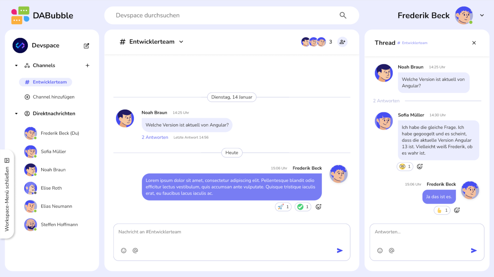
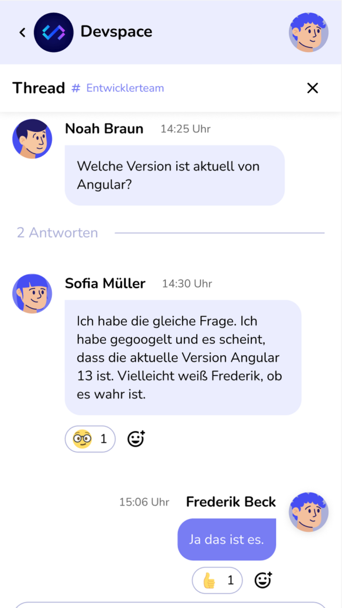

# DABubble - Discord Clone Chat App

[](https://angular.io/)
[](https://www.typescriptlang.org/)
[](https://firebase.google.com/)
[](https://sass-lang.com/)
[](LICENSE)

A real-time chat application inspired by Discord, built with Angular 21, Firebase, and
TypeScript. Channels, direct messages, threads, reactions, and user management.

---

## Live

| Environment | URL                                                                                |
| ----------- | ------------------------------------------------------------------------------------ |
| **Prod**    | [dabubble.dev2ksoftware.com](https://dabubble.dev2ksoftware.com)                     |
| **Staging** | [dabubble-staging.dev2ksoftware.com](https://dabubble-staging.dev2ksoftware.com)     |

---

## Preview

### Desktop View



### Mobile View



---

## Features

### User Account & Administration

- User registration - email/password with avatar selection
- User login - secure authentication with Firebase
- Google OAuth - login with Google (popup strategy)
- Password recovery - reset password via email
- Profile editing - update name and avatar
- Auth guards - route protection (auth, no-auth, avatar-selection)
- Online status - real-time user presence (planned)

### Channels & Direct Messages

- Channels - group discussions with multiple members
- Channel management - create, edit, manage channels
- Direct messages - private 1:1 conversations
- Message display - grouped by date with avatars
- Emoticon reactions - react to messages with emojis
- Threads - reply to specific messages in separate threads
  - Thread count display on parent messages
  - Last reply timestamp
  - Parent message shown in thread
  - Reactive loading with signals
- Mention users - tag members with `@username` (planned)
- Mention channels - reference channels with `#channel` (planned)
- Search messages - find messages across channels and DMs (planned)
- Emoticons in messages - emoji picker integration (planned)

### Channel Management

- Create channels - set name, description
- Channel list - sidebar navigation with mailbox
- Workspace UI - header with search, sidebar with channels/DMs
- Add members - invite users to existing channels (planned)
- Leave channels - exit channels you don't need (planned)
- Edit channels - modify name and description (planned)
- Duplicate prevention - no duplicate channel names (planned)

---

## Tech Stack

**Frontend**

- Angular 21 (Standalone Components, Signals, Zoneless)
- TypeScript 5.9 (Strict mode, isolatedModules)
- SCSS (BEM Methodology)
- RxJS 7.8
- NgRx SignalStore (State Management)

**Backend & Database**

- Firebase Authentication (Email/Password, Google OAuth Popup)
- Cloud Firestore (NoSQL Database)
- Firebase Storage (File uploads)
- Real-time listeners

**Code Quality**

- TypeScript Strict Mode
- ESLint & Prettier
- JSDoc Documentation
- Max 14 lines per function
- Max 400 LOC per file (general)

**DevOps & Hosting**

- GitHub (Version Control)
- Self-hosted on Unraid behind npmplus (Production: dabubble.dev2ksoftware.com)

---

## Project Structure

```text
dabubble/
├── .github/
│   ├── prompts/                      # Angular dev guides (modular)
│   └── workflows/
│       └── deploy.yml                # CI/CD pipeline
├── public/
│   ├── manifest-dark.webmanifest     # PWA manifest (dark)
│   ├── manifest-light.webmanifest    # PWA manifest (light)
│   └── img/                          # Public images & icons
├── src/
│   ├── app/
│   │   ├── core/                     # Singleton services, guards, models
│   │   │   ├── guards/               # Route guards
│   │   │   ├── models/               # Domain models (user, channel, message, ...)
│   │   │   └── services/             # Firebase, invitation, reaction, unread, i18n
│   │   ├── features/                 # Feature modules (business logic)
│   │   │   ├── auth/                 # Login, signup, password reset, avatar selection
│   │   │   ├── dashboard/            # Channels, DMs, threads, mailbox
│   │   │   └── legal/                # Imprint, privacy, terms
│   │   ├── layout/                   # Auth layout, main layout, header, sidebar, footer
│   │   ├── shared/                   # Reusable components & animations
│   │   ├── stores/                   # NgRx SignalStore (modular per feature)
│   │   ├── index.html                # HTML entry point
│   │   └── main.ts                   # Application bootstrap
│   ├── config/environments/          # env.dev.ts / env.prod.ts (gitignored) + examples
│   └── styles/                       # Global SCSS (variables, mixins, fonts, typography)
├── firebase.json                     # Firebase hosting configuration
├── firestore.rules                   # Firestore security rules
├── storage.rules                     # Cloud Storage security rules
├── angular.json                      # Angular workspace config
└── package.json                      # Dependencies & scripts
```

---

## Architecture

### Modular NgRx SignalStore Pattern

DABubble uses a modular store structure for complex features like authentication:

```text
stores/auth/
├── auth.store.ts              # Main store orchestrator
├── auth.types.ts              # State interface & initial state
├── auth.helpers.ts            # Mappers & state handlers
├── auth.login.methods.ts      # Login methods
├── auth.signup.methods.ts     # Signup methods
├── auth.password.methods.ts   # Password methods
└── index.ts                   # Barrel export
```

Single responsibility per file, easy to test methods in isolation, changes stay scoped to
the relevant file, and new features are easy to add without touching unrelated stores.

### Authentication Flow

**Google OAuth Strategy: Popup (Not Redirect)**

```typescript
// auth.login.methods.ts
async loginWithGoogle(): Promise<void> {
  const provider = new GoogleAuthProvider();
  await signInWithPopup(auth, provider);
}
```

`signInWithPopup()` avoids a full page reload, works reliably across hosting providers, and
needs no redirect handling or sessionStorage flags for post-login navigation.

### Thread System Architecture

Slack-style threading: users can reply to specific messages in separate conversation
threads.

```text
Message → Parent Component → Dashboard → Thread

User clicks thread icon
  → ConversationMessages emits threadClicked(messageId)
  → Parent finds message, emits threadRequested({ messageId, parentMessage })
  → Dashboard sets threadInfo signal
  → ThreadComponent reactively loads via effect()
  → Thread panel slides in from right
```

Thread count and last-reply timestamp are shown on parent messages; the parent message is
included in the thread view itself.

---

## Getting Started

### Prerequisites

- Node.js 24+ and pnpm
- Angular CLI 21+
- Firebase account

### Installation

```bash
git clone https://github.com/KosMaster87/DA-Bubble.git
cd DA-Bubble/da-bubble-app
pnpm install
```

Copy the example environment files and fill in your Firebase credentials:

```bash
cp src/config/environments/env.dev.example.ts src/config/environments/env.dev.ts
cp src/config/environments/env.prod.example.ts src/config/environments/env.prod.ts
```

```bash
pnpm start
# → http://localhost:4200/
```

---

## Development

```bash
pnpm start          # dev server (port 4200)
pnpm run build      # production build
pnpm run watch      # build with watch mode
pnpm test           # unit tests
ng generate         # generate components/services/etc.
```

### Code Standards

- Functions: max 14 lines, one task per function
- Files: max 100 LOC for modular stores, max 400 LOC for general files
- Naming: camelCase for variables/functions, PascalCase for classes/components
- Types: TypeScript strict mode, `isolatedModules: true`, no `any`
- Docs: JSDoc comments for all public methods
- CSS: BEM naming convention
- Stores: modular structure for complex features (`auth/`)
- Exports: `export type` for interfaces (isolatedModules requirement)

---

## Security

- Firebase Authentication for user management
- Firestore Security Rules for data protection
- Input validation and sanitization
- XSS protection
- Environment variables for secrets

---

## License

This project is licensed under the MIT License.

---

## Developer

**Konstantin Aksenov**

- [Portfolio](https://portfolio.dev2ksoftware.com)
- [LinkedIn](https://www.linkedin.com/in/konstantin-aksenov-802b88190/)
- [GitHub](https://github.com/KosMaster87)
- [konstantin@dev2ksoftware.com](mailto:konstantin@dev2ksoftware.com)

---

## Acknowledgments

- Developer Akademie for the project foundation
- Angular Team for the framework
- Firebase for backend services
